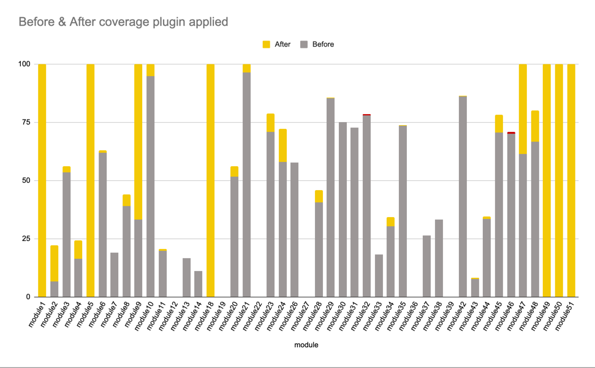

# CodeCoverage
[](https://jitpack.io/#Evleaps/CodeCoverage)

The code coverage plugin [based on Kotlin Kover from JetBrains](https://github.com/Kotlin/kotlinx-kover). This plugin adds a baseline support and the ability to configure your CI.

# Installation
Please, note that you must apply [Kover coverage plugin](https://github.com/Kotlin/kotlinx-kover) first. 
Current plugin extend functionality of the Kover plugin. But this plugin doesn't include one. 
You have to apply for it by your own hands. 

When you applied for the Kover plugin you can apply for this CodeCoverage plugin.
You need to add this code to your root build.gradle:

```kotlin
buildscript {
  repositories {
    // ...
    maven { url = uri("https://jitpack.io") }
  }

  dependencies {
    classpath("com.github.Evleaps:CodeCoverage:v1.0.0")
  }
}

apply(plugin = "code-coverage-plugin")

```

# New plugin terminal commands
If you are going to support code coverage check on your CI you can use this plugin.
This plugin adds new terminal commands to your project:

- `coverageGenerateReport` - this task will execute tests and create coverage reports for any module.
  You can find them here: `build/reports/kover/htmlDebug/index.html`
- `coverage` - this task will execute tests, generate a coverage report, and
  verify that a module's coverage percent isn't less than a baseline's value.
- `coverageBaseline` - updating baseline to new values. Note that you must execute `coverageGenerateReport` before.

# Configuration
```groovy
codeCoveragePlugin {
    // These modules will be excluded from the coverage report.
    excludedModules = [":design_system"]

    // A flavor postfix must be declared if your app has flavors. It will be used for run kover tasks
    // Example: "HuaweiDebug"
    // Result: will be run "koverHtmlReportHuaweiDebug"
    flavorTaskPostfix = "HuaweiDebug"
    // Modules with flavors must be declared here for running kover tasks with the right command.
    modulesWithFlavors = [":app"]

    // Baseline file name
    baselineFileName = "code_coverage_baseline"
    // Path where you can find your baseline
    baselinePath = "${project.rootDir}/tools/test-coverage/report/"
}
```

# Results 
On the current screen, you can see how the coverage changed in our project for 3 months.
It is real modules but names were changed. 

- 6 new modules covered by 100%;
- 4 modules' coverage was increased to 100% by initiative developers;
- Majority of modules increased their coverage;
- 2 modules decreased the coverage a bit;

Why decreased?
- The first case happened because was removed the AB-test code with tests;
- The second case happened because the team missed that a developer decided to break the rule; 

We can suggest applying the [code ownership](https://docs.github.com/en/repositories/managing-your-repositorys-settings-and-features/customizing-your-repository/about-code-owners) to the baseline file and nobody merge the baseline update without an owner approval. 



# Licence
Copyright (c) 2023 Global, Inc

Licensed under the Apache License, Version 2.0 (the "License"); you may not use this file except in compliance with the License. You may obtain a copy of the License at
```
http://www.apache.org/licenses/LICENSE-2.
```
Unless required by applicable law or agreed to in writing, software distributed under the License is distributed on an "AS IS" BASIS, WITHOUT WARRANTIES OR CONDITIONS OF ANY KIND, either express or implied. See the License for the specific language governing permissions and limitations under the License.

# Disclaimer
All information and source code are provided AS-IS, without express or implied warranties. Use of the source code or parts of it is at your sole discretion and risk. Global LLC takes reasonable measures to ensure the relevance of the information posted in this repository, but it does not assume responsibility for maintaining or updating this repository or its parts outside the framework established by the company independently and without notifying third parties.
